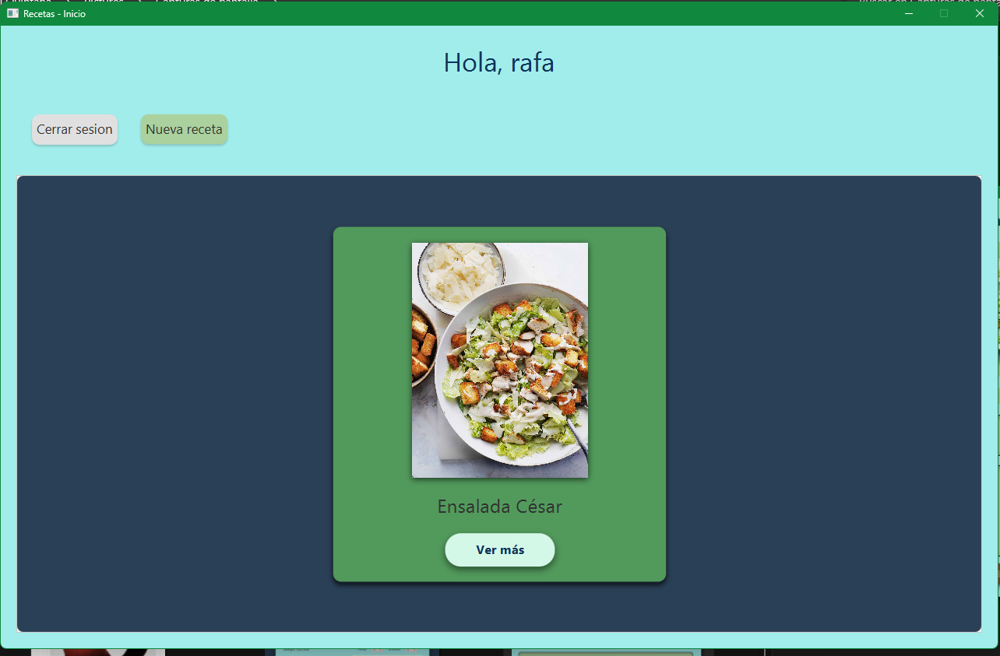
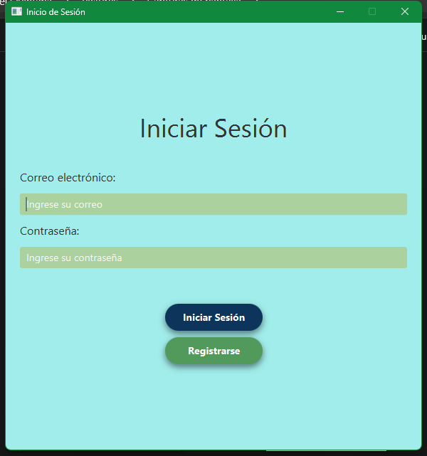
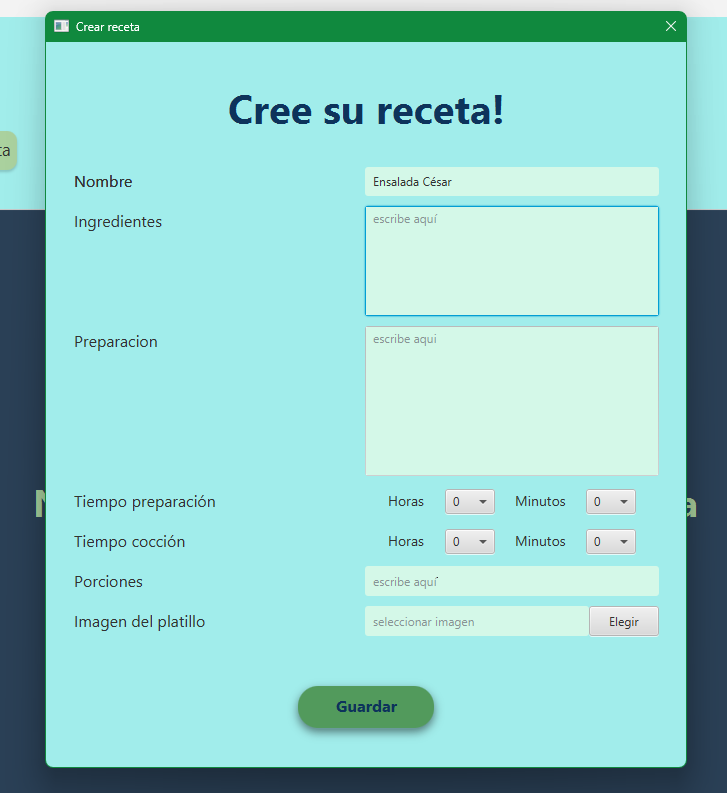
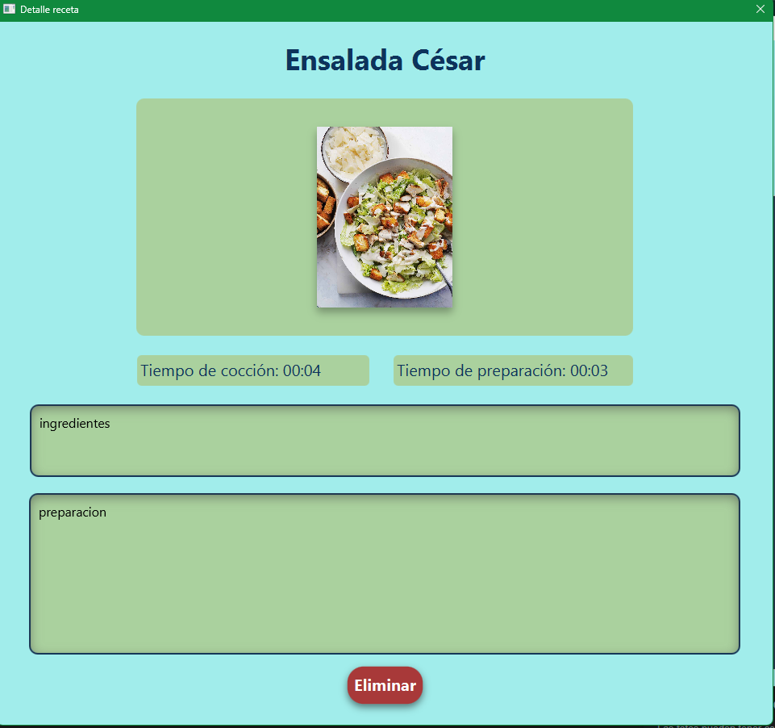

# App recetas de cocina
Una aplicación sencilla para diseñar cómodamente recetas de cocina y guardarlas en un solo lugar, donde también puedes añadir una imagen al platillo.

## Galería de la app

<p align="center">
  
  
  
  
</p>

## Funcionalidades de la app
**Front-end:** Cliente de escritorio que ofrece diferentes vistas simples y llamativas para cada funcionalidad de la app (login, registro, inicio).

**Back-end:** API RESTful para la gestión tanto de las recetas como de los usuarios. También incorpora seguridad mediante autenticación y conexiones con base de datos.

## Tecnologías utilizadas
**Front-end:** JavaFX, Maven.  
**Back-end:** JDK 21, Spring Boot, MySQL, Maven, Spring Security, JWT, Redis, Docker.

## Instalación

**Requisitos necesarios:**  
- Docker instalado y en ejecución  
- Git instalado

**Pasos:**

1. Clona el repositorio.
2. Configura las variables de entorno (encuentra y lee el archivo `env.example` para guiarte).
3. Navega hasta la raíz del proyecto, abre la terminal y ejecuta:

   ```bash
   docker-compose up --build
   ```

4. Busca la carpeta `instalador` y dentro de ella localiza el instalador: `AppRecetas-1.0.zip`y descomprímelo.
5. Haz clic sobre el instalador para instalar la app. Si todo sale bien, en tu escritorio deberías tener un acceso directo llamado "AppRecetas".
6. ¡Disfrute!
